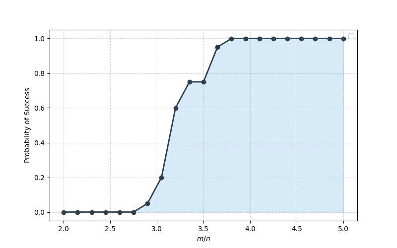

# Polyak Subgradient Method for Robust Phase Retrieval

This repository contains a high-performance Python implementation of the **Subgradient Algorithm with Scaled Polyak Step-size** for solving the **Robust Phase Retrieval** problem. The solver is designed to be robust against outliers by utilizing an $L_1$-norm objective function.

## 📌 Overview

Phase retrieval is the process of recovering a signal $x \in \mathbb{R}^n$ from the magnitude of its linear measurements:
$$b = |Ax|^2$$
This project implements a subgradient-based approach to minimize the following robust objective:
$$f(x) = \frac{1}{m} \sum_{i=1}^{m} | \langle a_i, x \rangle^2 - b_i |$$

### Key Features
* **Polyak Step-size:** Automatically adapts the step-size based on the distance to the optimal value.
* **Robustness:** Efficiently handles outliers using the $L_1$ loss formulation.
* **Phase Transition Study:** Tools to analyze the success probability relative to the oversampling ratio ($m/n$).
* **Convergence Analysis:** Built-in plotting for tracking objective decay and empirical linear convergence ratios.

## 🚀 Getting Started

### Prerequisites
Ensure you have Python 3.9+ installed. The following libraries are required:
* `numpy`
* `matplotlib`
* `seaborn`

### Installation
Clone the repository and install the dependencies:
```bash
git clone https://github.com/Morteza-Rahimi68/SPSG-for-robust-phase-retrieval.git
cd Scaled-Polyak-subgradient-method-for-robust-phase-retrieval
pip install numpy matplotlib seaborn
```


## 📊 Results and Visualizations

The following figures demonstrate the convergence behavior and performance of the Scaled Polyak Subgradient method under different oversampling ratios $\alpha = m/n$.

### 1️⃣ Convergence Analysis
These plots show how the objective function and the estimation error decrease over iterations.

| Objective Function Decay $f(x_k)$ | Estimation Error Decay $e_k$ |
| :-: | :-: |
|  |  |

### 2️⃣ Linear Convergence Ratios
To verify the linear convergence, we plot the ratios of consecutive iterations. A ratio below 1 indicates linear convergence.

| Objective Ratio ($f_{k+1}/f_k$) | Error Ratio ($e_{k+1}/e_k$) |
| :-: | :-: |
|  |  |

---

### 📉 3️⃣ Phase Transition Study
The "Phase Transition" plot illustrates the probability of successful signal recovery as a function of the measurement ratio $m/n$. As shown, a sharp transition occurs, typically around $\alpha \approx 3.5$ for this algorithm.

<p align="center">
  
</p>
